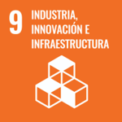

# Introducción a la Sostenibilidad

## 1. ¿Qué es la sostenibilidad y qué papel juega en el sector tecnológico actual?

La **sostenibilidad** es el conjunto de acciones o medidas que se pueden aplicar para ayudar al **medioambiente**, la **sociedad** o la **economía**, mientras que se permite una buena calidad de vida sin afectar a la calidad de vida de las **próximas generaciones**.

En el sector tecnológico actual es muy importante tener en cuenta la sostenibilidad ya que las **nuevas tecnologías** deben minimizar el **impacto medioambiental** a la vez que deben ser **reciclables** o al menos intentar que no generen muchos **residuos electrónicos** para cuando termine su ciclo de vida, además es importante realizar un **consumo energético** responsable a la vez que se intenta **optimizar los recursos** de la forma más sostenible posible.

>Lo que le hacemos al mundo, nos lo hacemos a nosotros mismos. – Mahatma Gandhi

## 2. ¿Qué dimensiones abarca (ambiental, social, económica)?

Indagando más en cada uno de los pilares de la sostenibilidad: 

- **Pilar ambiental:** Se basa en la gestión adecuada de recursos, el control de los residuos medioambientales, minimización de residuos, etc... 

- **Pilar social:** Se basa en garantizar una serie de características (buena calidad de vida) a toos los ciudadanos sin perjudicar a los ciudadanos futuros, en este pilar se encuentran la inclusión, la igualdad de oportunidades, derechos y deberes igualitarios, etc... 

- **Pilar económico:** Se basa en mantener el crecimiento económico sin agotar los recursos o perjudicar a los otros dos pilares de la sostenibilidad y sin comprometer a futuras genercaciones, todo esto mediante el uso de prácticas éticas, responsables y equitativas. 

## 3. ¿Qué son los aspectos ASG y por qué deben interesar a una empresa tecnológica?

Los aspectos ASG (Ambientales, Sociales y de Gobernanza) son un conjunto de criterios usados para medir la sostenibilidad y el impacto de una empresa en su entorno, cada una de sus siglas son los distintos aspectos que abarca:

- **Ambientales:** El impacto que la empresa tiene en el medioo ambiente.

- **Social:** Abarca las relaciones de la empresa con las personas y la sociedad.

- **Gobernanza:** Manera en la que se gestiona y dirige la empresa.

Deben interesar a una empresa tecnológica ya que **reducen los riesgos** en los modelos de negocio de las empresas y resultan en una **mejora de innovación empresarial** al redirigir los criterios de inversión y financiación.

## 4. ¿Qué marcos internacionales impulsan la sostenibilidad (Agenda 2030, ODS)?

Hay cuatro grandes marcos internacionales que impulsan la sostebinilidad, estos son:

- **Agenda 2030:** Es un plan de acción en favor de los derechos de las personas, el planeta y la prosperidad para alcanzar un desarrollo sostenible propuesto y acordado por 193 miembros de la ONU, está formadapor 17 Objetivos de Desarrollo Sostenible (ODS) y 169 metas.

- **Objetivos de Desarrollo Sostenible (ODS):** Son un conjunto de propósitos a alcanzar para mejorar las condiciones socioeconómicas, mediambientales y económicas. Existen 17 ODS y tienen asignadas 169 metas.

- **Acuerdo de París:** Es un tratado internacional jurídicamente vinculante entre 196 partes que consiste en limitar el calentamiento mundial a por debajo de 2 en comparación con niveles preindustriales. Para lograr este objetivo los países se proponen alcanzar lo antes posible el máximo de emisiones de gases de efecto invernadero para lograr un clima neutral para mediados de siglo.

- **Marco de Sendai:** Es un acuerdo global de la ONU que busca reducir el número de muertes, pérdidas económicas y daños en infraestructuras causados por desastres naturales y desastres provocados.

## 5. ¿Qué tres ODS están más relacionados con la informática o el desarrollo de software?

| **Nombre de ODS** | **Imagen de ODS** | **Relación con la informática** |
| ----------------- | ----------------- | ------------------------------- |
| **Educación de calidad** |   | Permitir a los ciudadanos el acceso económico a herramientas importantes tales como ordenadores, portátiles o similares para facilitar la enseñanza. |
| **Trabajo decente y crecimiento economico** |  | Dentro del campo de la informática existen muchos puesto de trabajo que permiten el crecimiento económico. |
| **Industria, innovacion e infraestructura** |  | Creación de infraestucturas sostenibles y menos contanimantes con el uso de nuevas tecnologías. |
