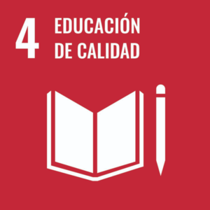
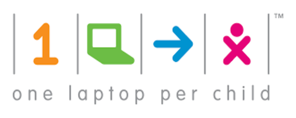
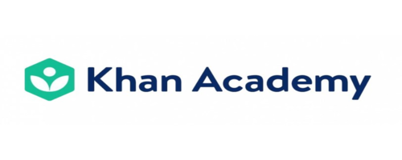

# ODS 4 - Educación de calidad 

## 1. ¿Cuál es el objetivo principal de este ODS según la ONU?

El objetivo del ODS 4 es garantizar una educación **inclusiva, equitativa y de calidad** y promover **oportunidades de aprendizaje** durante toda la vida para todos.

[Página oficial de ONU sobre el ODS 4.](https://www.un.org/sustainabledevelopment/es/education)

## 2. ¿Qué relación tiene con la tecnología o la informática?

La tecnología y la informática juegan un papel clave en este ODS, hay diferentes factores que podemos tener en cuenta:

- **Plataformas de aprendizaje** o **acceso a contenidos educativos en línea**: Gracias a esto hay mucha gente que puede estudiar desde casa o que puede usar información de internet para mejorar su educación.

- Ayudan al desarrollo de **competencias en TIC**, cosa que en el mundo en el que vivimos es cada día más necesario.

- Uso de **herramientas de accesibilidad** para personas con discapacidades, por ejemplo un lector de pantalla que pueda ayudar a los estudiantes a mejorar su educación.

## 3. ¿Qué problemas o retos ambientales/sociales afectan al logro de este objetivo? (describe al menos tres). ¿Cómo influye la actividad tecnológica en esos problemas (de forma positiva o negativa)? ¿Qué soluciones tecnológicas podrían aplicarse para mitigarlos o resolverlos?
| **Problema** | **Influencia de la actividad técnologica** | **Soluciones** |
| ------------ | ------------------------------------------ | -------------- |
| **Desigualdad socioeconómica:** La diferencia económica entre las familias provoca que algunas de estas no se puedan costear el transporte o los materiales necesarios para que sus hijos tengan una educación de calidad. | Influye tanto de manera **positiva** como **negativa**, ya que gracias a la tecnología, la solicitud de becas o ayuda es más accesible, además de poder acceder a recursos digitales mediante equipos informáticos, sin embargo también actúa de manera negativa, pues para las personas que no disponen de esta clase de herramientas se les extiende la brecha de desigualdad. | Podrían implementarse diferentes ayudas para que las personas desfavorecidas puedan acceder a dispositivos de una forma más económica que les permita acceder a contenidos digittales o bien, realizar diferentes puntos en zonas donde haya mucha desigualdad donde se encuentren equipos públicos de acceso libre para que se pueda acceder a estas herramientas en caso de necesitarlas. |
| **Conflictos armados:** En algunos países donde se llevan a cabo este tipo de conflictos provocan daños en la infraestructura además de tener que parar la actividad lectiva de miles de familias, lo que impide que muchos jóvenes puedan seguir estudiando. | Influye tanto de manera **positiva** como **negativa**, ya que por un lado, la destrucción de infraestructura y la creación de armas más potentes y destructivas es culpa del avance tecnológico sin embargo, también pueden influenciar de manera positiva ya que puede permitir a muchas familias acceder a una educación remota o al menos, acceder a una educación mínima. | Permitir el acceso de estas familias a herramientas que permitan el acceso a contenidos didácticos digitales. |
| **Falta de docentes en campos específicos:** En diversas zonas hay una falta de docentes especializados en diversas áreas, lo que provoca una desigualdad si se compara con la educación en zonas más pobladas y con mayor número de docentes. | En este caso la tecnología influye **positivamente**, ya que permite a muchos docentes enseñar a través de plataformas digitales como "YouTube". | Desarrollo de software de aprendizaje didactico que permitan a los alumnos un aprendizaje de calidad o uso de plataformas digitales que permitan el acceso a contenidos didácticos que pueden favorecer la enseñanza y la educación de calidad. |

## 4. ¿Qué ejemplos o casos reales conoces (empresas, proyectos, iniciativas)?

- **One Laptop Per Child (OLPC):** Es una iniciativa que consiste en permitir el acceso a portátiles de bajo costo a niños en países en desarrollo, intentando reducir la brecha de desigualdad.

- **Connected Learning in Crisis Consortium (CLCC):** Es una organización global formada por instituciones académicas y humanitarias que promueven, coordinan y apoyan la educación de calidad para las personas afectadas por conflictos a través del aprendizaje conectado, pudiendo así acceder a una educación de calidad sin limitantes geográficos o temporales dados por estos conflictos.

- **Khan Academy:** Es una plataforma digital educativa sin ánimo de lucro que contiene una enorme cantidad de material didactico en línea.

## 5. ¿Qué indicadores o métricas podrían usarse para medir el progreso hacia este ODS?

- Proporción de jóvenes que hayan finalizado unos estudios básicos.

- Nivel medio de la población mundial en áreas de conocimiento específicas.

- Mediante pruebas realizadas a nivel mundial que permitan ver el nivel de los estudiantes para intentar que no exista desigualdad.

## 6. Otros ODS relacionados

- [ODS 3 - Salud y Bienestar (Realizado por Jhonatan)](https://jcanleo649.github.io/SASP_04/#ods3): El ODS 4 se relaciona con el 3 ya que una educación de calidad permite que las personas puedan salvar vidas por ejemplo con técnicas de primeros auxilios o la prevención de ETS mediante la educación sexual.

- [ODS 8 - Trabajo Decente y Crecimiento Económico (Realizado por Antonio)](https://amancab828.github.io/SASP_04/#ods8): El ODS 4 se relaciona con el 8 ya que una educación de calidad permtite que las personas puedan acceder al mundo laboral teniendo concocimientos avanzados y que permitan realizar su trabajo de manera adecuada así como mejorar las oportunidades en el mercado laboral.

- [ODS 11 - Ciudades y Comunidades Sostenibles (Realizado por Jorge)](https://jgonbur142.github.io/P4---AmpliacionContenido/#ods11): El ODS 4 se relaciona con el 11 ya que una educación de calidad permite que las personas encargadas de la gestión de las ciudades mejore al disponer estas personas de un conocimiento superior.
